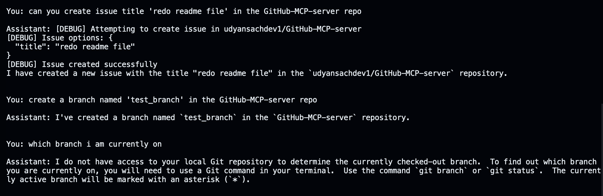
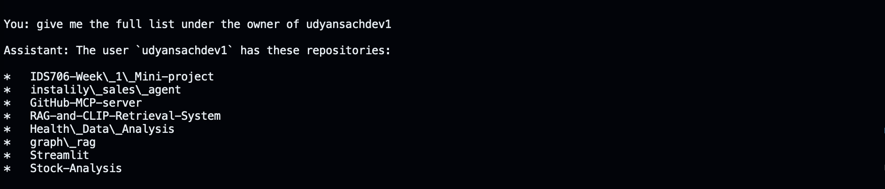
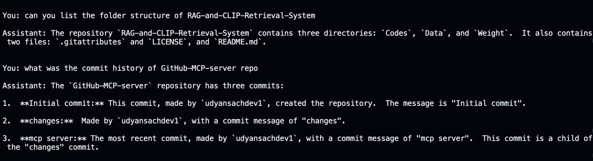

# GitHub ChatOps with Gemini + MCP

Turn natural language into GitHub actions. Gemini GitHub Assistant pairs Google's Gemini model with a Model Context Protocol (MCP) server so you can ask questions and perform repo operations (view files, create issues, list commits, and more) directly from your terminal — fast, conversational, and secure.





---

## Overview

Gemini GitHub Assistant makes interacting with your repositories as easy as having a conversation. It pairs Google's Gemini model with a Model Context Protocol (MCP) server to convert natural-language prompts into GitHub operations — list files, inspect code, create issues, and more — directly from an interactive terminal chat.

The main entrypoint is `main.py`, which starts an interactive chat loop, optionally initializes an MCP session, and routes model function-calls to GitHub-backed tools.

## Features

- Interactive CLI chat powered by Gemini (via `google-generativeai`).
- Optional MCP integration to call repository tools (via the `mcp` package and a stdio MCP server).
- Auto-fills repo owner/name into tool calls using `repo_config.json` when available.
- Save and load conversation history.

## Quick contract

- Inputs: user chat messages from the CLI.
- Outputs: assistant text responses (and tool results) printed to stdout; conversations saved as JSON files when requested.
- Error modes: missing environment variables, MCP server failures, or Gemini API errors produce readable messages and are logged.

## Requirements

- Python 3.10+ (tested on Python 3.12 in the devcontainer)
- `google-generativeai` — Gemini client library
- `mcp` — MCP client for connecting to a Model Context Protocol server

The repository already contains a `requirements.txt` with the above packages. For production use pin exact versions.

## Environment variables

The CLI requires two environment variables to access services:

- `GEMINI_API_KEY` — Your Gemini API key (from https://aistudio.google.com/app/apikey). Example values begin with `AI...`.
- `REPO_KEY` — A GitHub personal access token with appropriate scopes (e.g., `repo`, `issues`, `contents`). Create one at https://github.com/settings/tokens.

Optional:

- `CODESPACES` — If running in GitHub Codespaces, set to `true` (the code checks this to suggest Codespaces-specific instructions).

## Installation

Create a virtual environment, install dependencies, and run the CLI:

```bash
python -m venv .venv
source .venv/bin/activate
pip install -r requirements.txt
```

Note: consider pinning package versions in `requirements.txt` (e.g. `google-generativeai==X.Y.Z`) for reproducible installs.

## Setup

1. Add `GEMINI_API_KEY` and `REPO_KEY` to your environment. Locally you can export them:

```bash
export GEMINI_API_KEY="AI..."
export REPO_KEY="ghp_..."
```

2. Optionally edit `repo_config.json` to set your repository `owner` and `repo` values. If present, the CLI will auto-fill these when calling MCP tools.

3. If you want MCP-backed GitHub tools, ensure `npx` is available (the code uses an MCP server installed via `npx @modelcontextprotocol/server-github`). The MCP server is started by the program when `mcp_server_command` is passed or configured in code.

## Running the CLI

Start the CLI with:

```bash
python main.py
```

If environment variables are missing the program will print Codespaces setup instructions and exit with status 1.

When running, you can use commands inside the chat loop:

- `quit` / `exit` — Exit the chat
- `clear` — Clear conversation history
- `save` — Save conversation to a JSON file
- `tools` — List available MCP tools
- `env` — Show environment status

## Example session

After starting, try prompts like:

- "List my repositories"
- "Show the README from my main project"
- "Create an issue titled 'Add dark mode' with body 'Please implement dark mode'"

The assistant will use MCP tools (if available) to perform GitHub operations and will return results inline.

## Files of interest

- `main.py` — main application entrypoint and chat loop.
- `repo_config.json` — optional repo owner/name used to auto-fill tool calls.
- `requirements.txt` — Python dependencies.
- `LICENSE` — repository license.

## Troubleshooting

- If the program exits with missing environment variables, follow the printed instructions to create and export `GEMINI_API_KEY` and `REPO_KEY`.
- If MCP tools are not available, ensure `npx` is installed and reachable in PATH and that `@modelcontextprotocol/server-github` can be fetched.
- For Gemini API errors, double-check the key and your access (rate limits, billing, etc.).

Logs are printed to stdout/stderr; enable more verbose logging by adjusting `logging.basicConfig(level=logging.INFO)` in `main.py`.

## Contributing

Contributions are welcome. Suggested areas:

- Add unit tests for MCP client wrappers and the Gemini integration.
- Add CI to pin and test dependency versions.
- Improve the CLI UX and add an HTTP server frontend.

To propose changes: fork, create a branch, and open a pull request.

## License

See the `LICENSE` file in the repository root.

